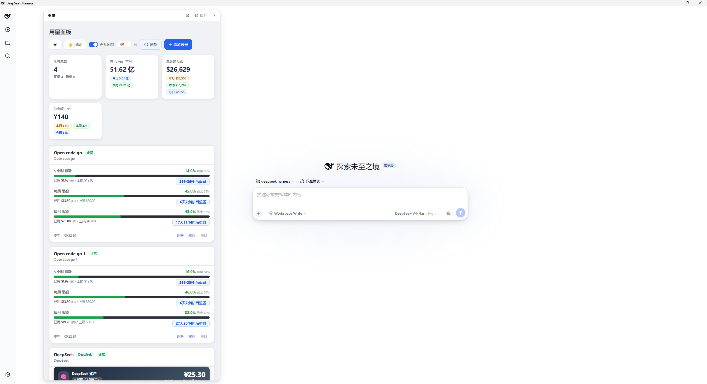
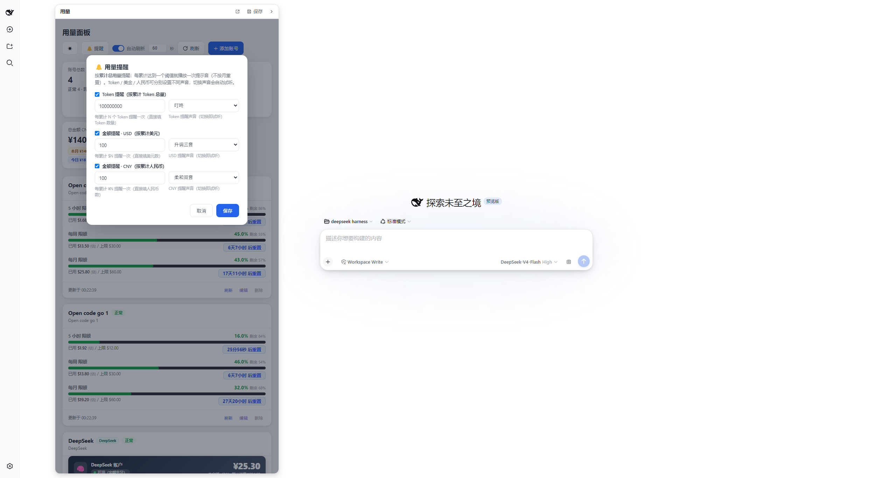
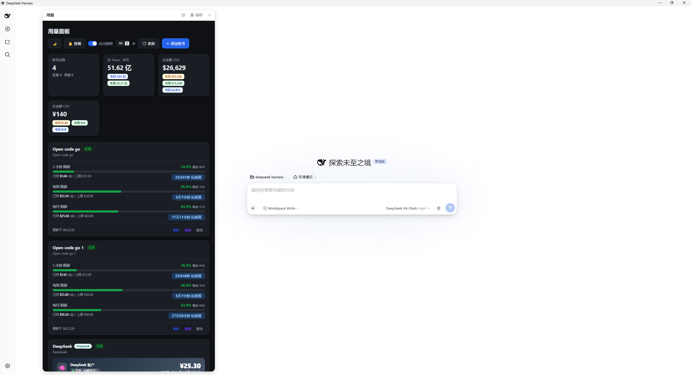
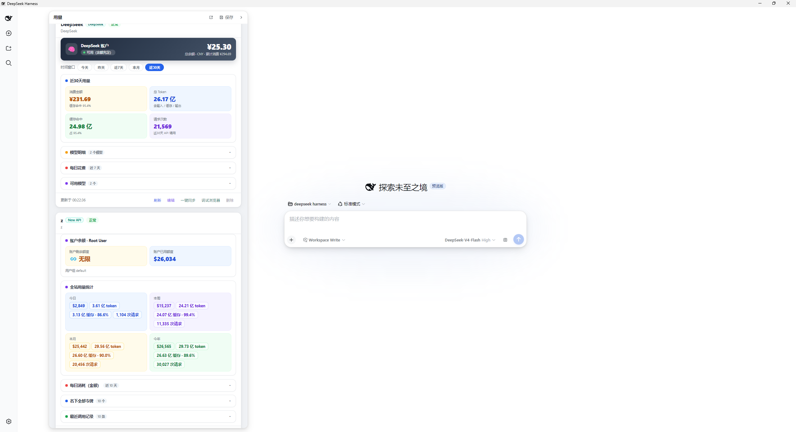
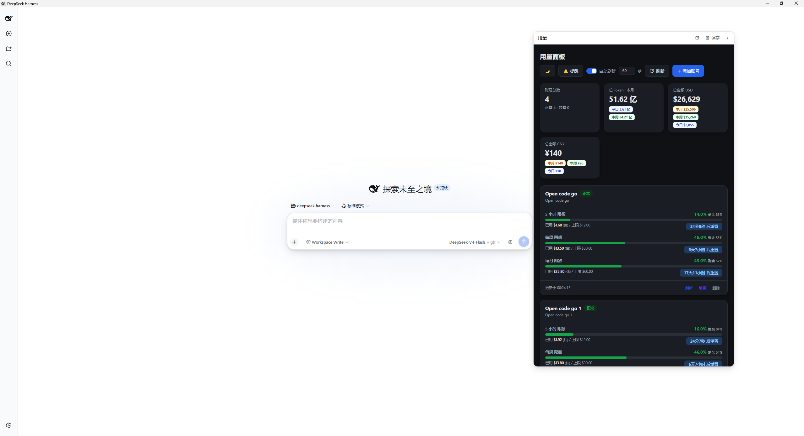

# dsh-usage-monitor

Floating **usage dashboard** for [DeepSeek Harness](https://github.com/deepseek-ai/deepseek-harness): a collapsible panel showing your Go / DeepSeek / New API usage in the corner of the app.

## Features

- Floating collapsible panel (toggle button top-right)
- Shows the embedded usage dashboard iframe
- Availability: needs the **DeepSeek Harness desktop shell** (Electron) to provide the dashboard URL; in a plain browser it shows a "desktop only" hint

## Install

```bash
dsh plugin --profile web add dsh-usage-monitor
```

## Screenshots











## Development

```bash
npm run check
npm publish --registry https://registry.npmjs.org
```

## License

MIT
