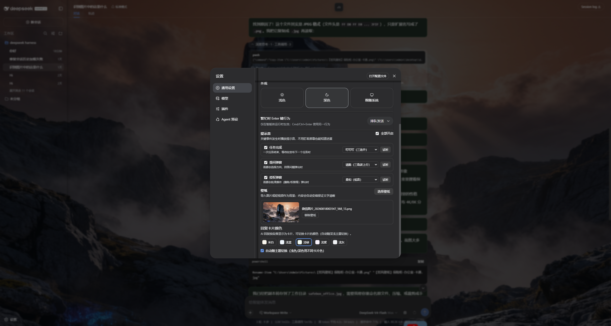

# dsh-wallpaper-plus

Fullscreen wallpaper for [DeepSeek Harness](https://github.com/deepseek-ai/deepseek-harness): import an **image or short video** as the app background, with auto dark-mode on video import and a video-audio toggle.

## Features

- 🖼️ Image wallpaper (PNG/JPG/WebP/GIF up to 8MB)
- 🎬 Video wallpaper (up to 100MB — supports 2K / 5–10s clips)
- 🌙 Auto-switches to dark mode when you import a video (bright clip reads best under the dim)
- 🔊 Optional video audio (toggle in the settings row)
- 💾 Persists across restarts (localStorage)

## Install

```bash
dsh plugin --profile web add dsh-wallpaper-plus
```

Then open **Settings → General → Wallpaper** to import.

## Screenshots



## Development

```bash
npm install
npm run check      # node --check lib/index.js lib/client.js
npm publish --registry https://registry.npmjs.org
```

## License

MIT
